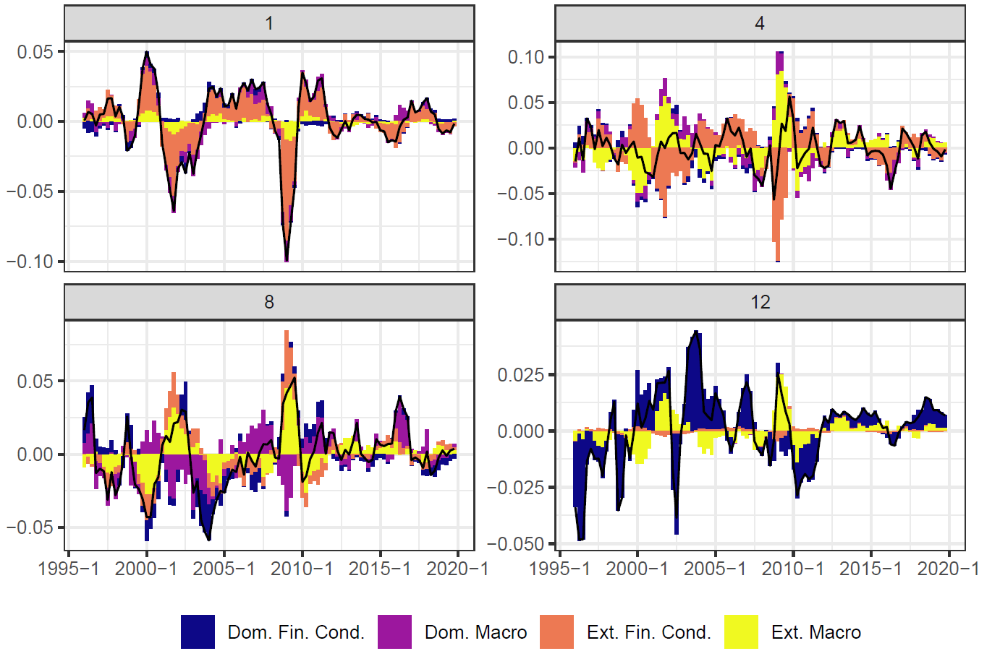
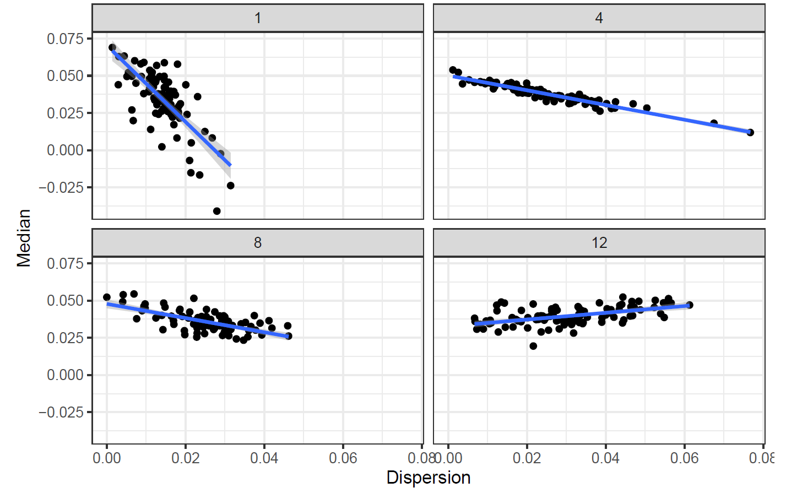
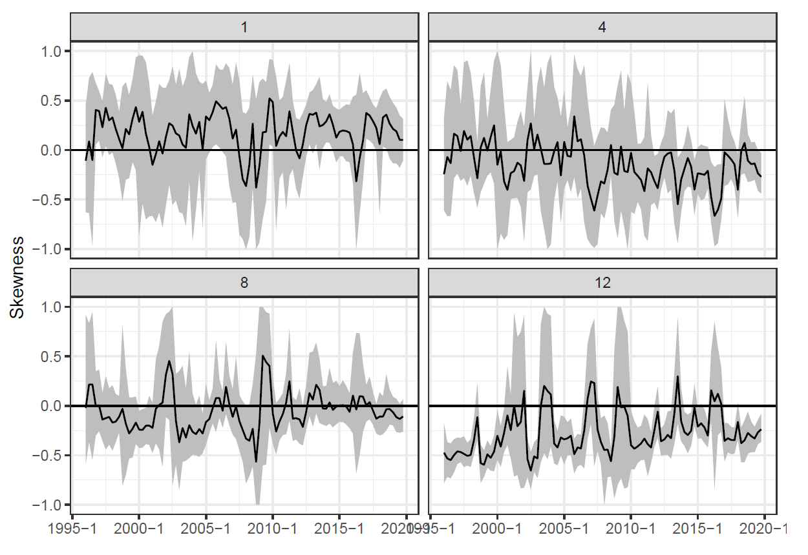
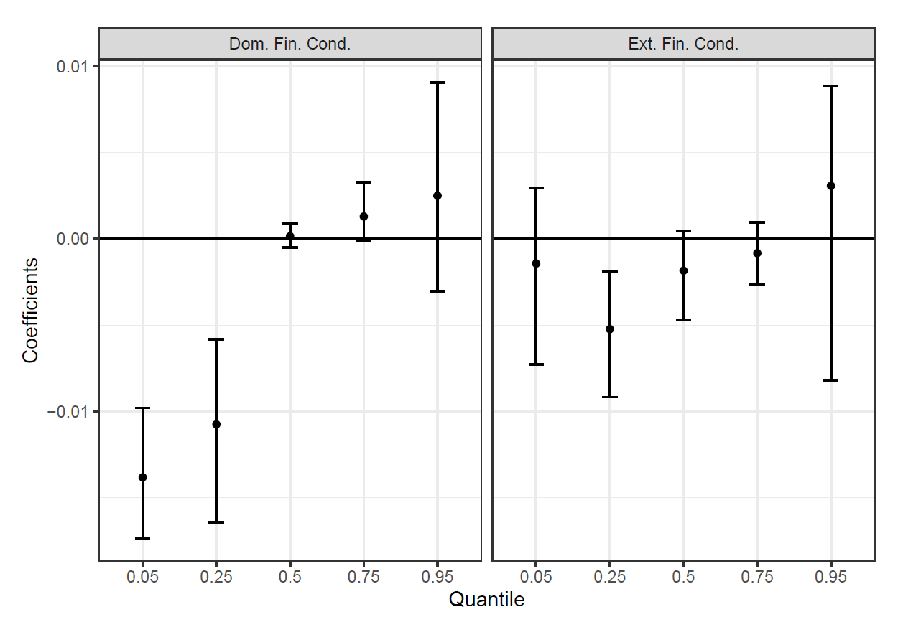
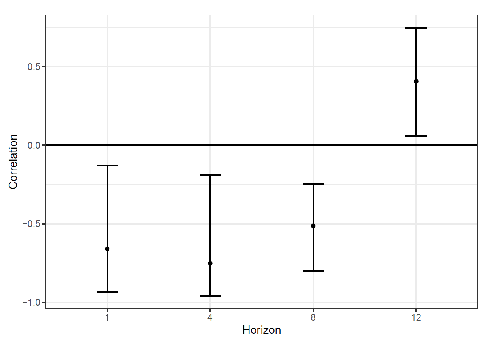
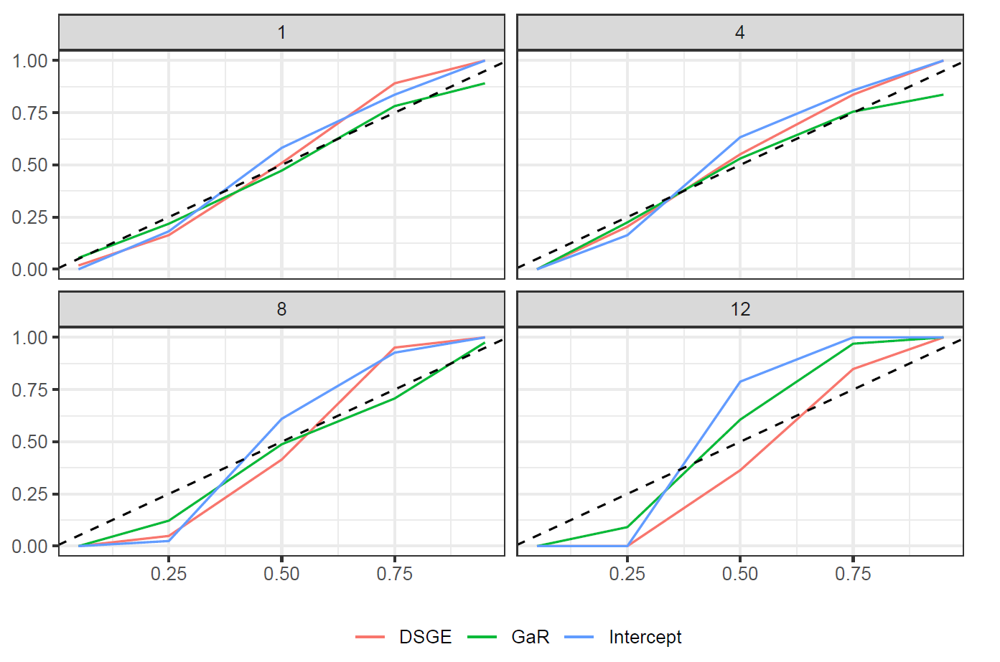
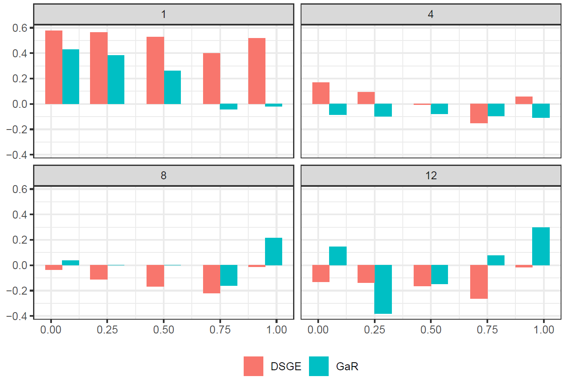
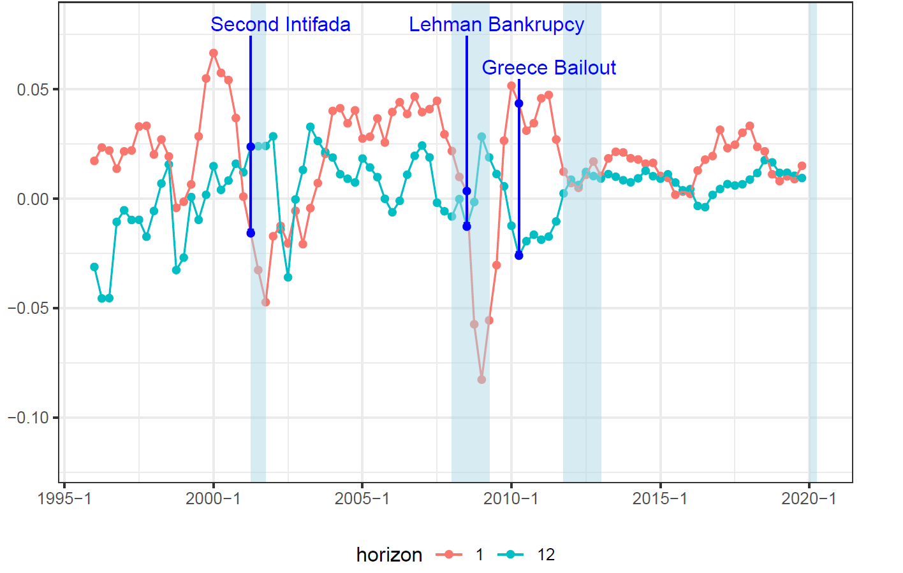
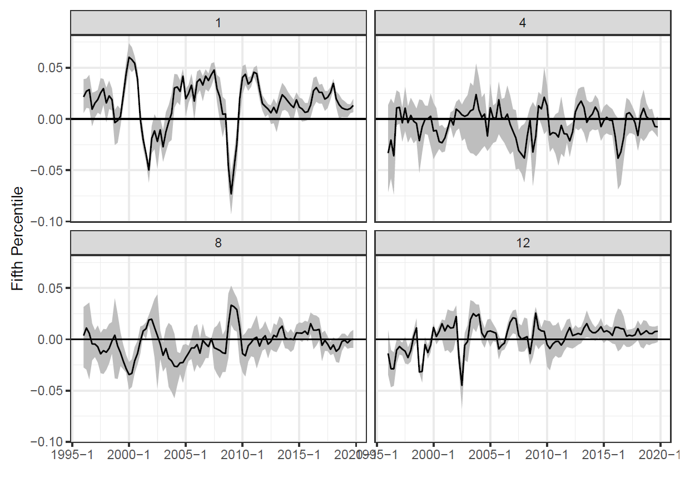

```{r, include = FALSE}
knitr::opts_chunk$set(
  collapse = TRUE, echo = FALSE, message = FALSE,
  warning = FALSE, comment = "#>"

)
```


```{r init_setup}

devtools::load_all()

library(GaRPackg)

setwd(paste0(
  file.path(Sys.getenv("USERPROFILE"),fsep = "\\"),
  "\\Documents\\GaRPackg\\vignettes"))

library(tidyverse)

library(cowplot)

library(broom)

library(gghighlight)

```


```{r set_params}

partitions_list = list(
  dom_macro = c(
    "private_consumption",
    "public_consumption",
    "investment",
    "unemployment"),
  ext_macro = c(
    "oecd_imp",
    "exports",
    "imports"
  ),
  dom_fin = c(
    "credit",
    "house_price",
    "ta125_close",
    "boi_rate"
  ),
  ext_fin = c(
    "rate_euro",
    "rate_us",
    "sp500",
    "eurostoxx600",
    "oil_p",
    "non_energy_p"
  )
)


horizon_list=c(1,4,8,12)

quantile_vec=c(0.05,0.25,0.5,0.75,0.95)


theme_set(theme_bw() + 
            theme(title = element_text(size = 20),
                axis.text = element_text(size = 15),
                axis.title = element_text(size = 15),
                strip.text = element_text(size = 15),
                legend.position = "bottom",
                legend.title = element_blank(),
                legend.text = element_text(size = 15)))


```

```{r load_data}

raw_df = import_from_fame_template(
  paste0(
    file.path(Sys.getenv("USERPROFILE")),
    "\\OneDrive - Bank Of Israel\\Data\\BoI\\GaR_Data\\Working_data\\data_fame.csv"
  )
)

df = raw_df %>%
  select(date, starts_with("gdp"),
         any_of(unlist(partitions_list, use.names = FALSE))) %>%
  preprocess_df(
    vars_to_yoy = c(
      "gdp",
      "private_consumption",
      "public_consumption",
      "investment",
      "oecd_imp",
      "exports",
      "imports",
      "sp500",
      "eurostoxx600",
      "oil_p",
      "non_energy_p",
      "credit",
      "house_price",
      "ta125_close"
    ),
    vars_to_diff = c("unemployment",
                     "boi_rate",
                     "rate_euro",
                     "rate_us"),
    vars_to_4_ma = c("gdp_us",
                     "gdp_euro")
  ) %>%
  mutate(across(c("gdp_euro", "gdp_us"), ~ . / 25))


```

```{r run_analysis}

gar_analysis = run_GaR_analysis(
  partitions_list = partitions_list,
  vars_df = df %>% 
  filter(date <= as.yearqtr("2019 Q4")),
  target_var_name = "gdp",
  horizon_list = horizon_list,
  quantile_vec = quantile_vec,
  pca.align.list = list(dom_macro = "private_consumption",
                        ext_macro = "exports",
                        dom_fin = "credit",
                        ext_fin = "sp500"))

```

```{r out_of_sample_forecast}

dsge_forecast = import_dsge_forecasts(
  paste0(
    file.path(Sys.getenv("USERPROFILE")),
    "\\OneDrive - Bank Of Israel\\Data\\BoI\\GaR_Data\\DSGE forecasts.xlsx"
  )
) %>% 
  filter(target_var == "gdp") %>% 
  select(-target_var)

gar_forecast = get_gar_forecast(partitions_list = partitions_list,
                                vars_df = df %>% 
                                  filter(date <= as.yearqtr("2019 Q4")),
                                target_var_name = "gdp",
                                horizon_list = horizon_list,
                                quantile_vec = quantile_vec,
                                win_len = 40,
                                win_type_expanding = TRUE)

intercept_forecast = get_gar_forecast(partitions_list = NULL,
                                vars_df = df %>% 
                                  filter(date <= as.yearqtr("2019 Q4")),
                                target_var_name = "gdp",
                                horizon_list = horizon_list,
                                quantile_vec = quantile_vec,
                                win_len = 40,
                                win_type_expanding = TRUE)


```


```{r import_robustness_data, eval=FALSE}

fit_df = read_rds(paste0(
  file.path(Sys.getenv("USERPROFILE"), fsep = "\\"),
  "\\OneDrive - Bank Of",
  " Israel\\Data\\BoI\\GaR_Data\\fit_df.RDS"))

```

## Outline

\tableofcontents[sectionstyle=show/show,subsectionstyle=hide/hide]

## Motivation

\begin {itemize}
\itemsep3em
	\item
	Assessing risks to future economic activity is essential for making knowledgeable forecasts.
	\item
	An important factor: financial vulnerabilities.
	\item
	We provide a methodological tool for assessing risks to growth in Israel using real and financial variables:

	\vspace{1em}

\begin{center}
\begin{block}{}

	Given current macro-financial conditions, what is the distribution of
	expected economic growth?

\end{block}
\end{center}

\end{itemize}


## Motivation

\centering
Quantile Regressions of YoY GDP Growth Four Quarters Ahead

\vspace{3mm}

```{r plot_gdp_credit}

temp_df = df %>%
  select(all_of(c("gdp","credit"))) %>%
  add_leads_to_target_var(target_var_name = "gdp",
                          leads_vector = 4) %>%
  filter(complete.cases(.))

plot_list = map(list("gdp","credit"), function(temp_var){

temp_qreq = rq(paste0("gdp_4","~",temp_var),
               tau = c(0.05,0.5,0.95),
               data = temp_df) %>%
  coefficients() %>%
  t() %>%
  as.data.frame() %>%
  rownames_to_column() %>%
  mutate(rowname = str_remove_all(rowname, "tau= ")) %>%
  rename(Quantile = rowname,
         my_int = `(Intercept)`,
         my_slope = !!sym(temp_var))

temp_plot = temp_df %>%
  ggplot(aes(x = !!sym(temp_var),
             y = gdp_4)) +
  geom_point() +
  geom_abline(data = temp_qreq,
              aes(intercept = my_int,
                  slope = my_slope,
                  color = Quantile)) +
  scale_color_manual(values = c("red","black","green")) +
  scale_x_continuous(
    labels = scales::percent_format(accuracy = 1)) +
  scale_y_continuous(
    labels = scales::percent_format(accuracy = 1)) +
  scale_color_manual(values = c("red","black","green")) +
  xlab(paste("YoY", temp_var, "growth")) +
  ylab((paste("YoY gdp growth 4 quarters ahead"))) +
  ggtitle(if_else(temp_var == "gdp","GDP","Credit")) +
  theme(legend.position = "none")

  return(temp_plot)

})

legend_p = get_legend(
  plot_list[[1]] + theme(legend.position = "bottom",
                         legend.title = element_text(size = 15)))

plot_grid(plot_grid(plotlist = plot_list,ncol = 2),
          nrow = 2,
          legend_p, rel_heights = c(1,0.2))

```

## The Growth at Risk (GaR) Approach

\vspace{1em}

* GaR is a linear model of density forecasts
  + Based on quantile regression
  + Parsimonious
  + Easy to interpret

\vspace{1em}

* Proposed by Adrian et al. (2019), operationalized by the IMF (Prasad et al., 2019).

\vspace{1em}

* Applied to:
  + Advanced economies (Aikman et al., 2018, 2019; Alessandri et al., 2019)
  + Developing economies (Komatsuzaki and Brito, 2019; Bespalova and Rousset,	2019)


## Contribution

\vspace{3em}

\begin{itemize}
  \setlength\itemsep{3em}
  \item
  Tools for regular assessment of risks:
  \begin{itemize}
    \item
    5th percentile of forecast
    \item
    State-dependent fan charts
  \end{itemize}
  \item
  Improve understanding of macro-financial linkages in Israel:
  \begin{itemize}
    \item
    Provide empirical evidence to support macro-financial modeling
  \end{itemize}
\end{itemize}


## Main Results

\begin{itemize}
\setlength\itemsep{1.5em}
\item
In-sample properties of the distribution of expected GDP growth:
  \begin{enumerate}
	\item
	\textbf{Symmetric} -- upside and downside risks are balanced.
	\item
	\textbf{Forecast uncertainty} rises when the median forecast decreases.
	\item
	\textbf{Financial Vulnerabilities} -- accomodative financial conditions contribute to
	        medium term risks to growth.
  \end{enumerate}
\item
These properties are robust to variable selection.
\item
Out-of-sample forecast performance in distribution tails is similar to benchmark models.

  \begin{itemize}
    \item but GaR allows state-dependent evaluation of risks
  \end{itemize}
  
\end{itemize}


# Methodology and Estimation Results
## Methodology


\label{methodology}

(IMF: Prasad et al., 2019)
\begin{enumerate}
	\item
	\textbf{Partition data:} divide a large number of variables
	into $K$ groups ($K$ small).
	\item
	\textbf{Dimension reduction} to alleviate overfitting:
	\begin{itemize}
		\item
		From each group $k\in\{1,...,K\}$, generate a single
		regressor $x^k_t$
		\item
		Method: first principal component
	\end{itemize}
	\item
	\textbf{Quantile regressions --}
	estimate a forecast equation for each quantile $\tau$
	and horizon $h$:
	$$
	Q^{\tau}_{t,h}=\beta^{\tau}_hX_t+\epsilon^{\tau}_{t,h}
	$$

	\vspace{0.5em}

	where $ X_t=[1, x^1_t, ... , x^K_t]$
	\vspace{1em}
	\begin{flushright}
		\hyperlink{QuantileReg}{\beamerbutton{quantile reg}}
	\end{flushright}
\end{enumerate}


## Data Partitioning

\label{DataPartitioning}

Sample: 1996Q1-2019Q4

<!-- \flushleft -->

\vspace{1em}

\scriptsize

\begin{tabular}{cccc}

  \vspace{2em}

		\textbf{Domestic Macro} & \textbf{Domestic Financial Cond.} &
		\textbf{External Macro}	& \textbf{External Financial Cond.} \\


	\vspace{1em}


		Private consumption & BOI rate & Exports & Federal Funds rate \\

	\vspace{1em}

		Real Investment & Private credit & Imports & Eonia \\

	\vspace{1em}

		Public consumption & House price index & OECD imports & SP500 \\

	\vspace{1em}

		Unemployment & TA125 &  & Eurostoxx600 \\

	\vspace{1em}

		&  &  & Brent oil price \\

	\vspace{1em}

		&  &  & Non energy commodity \\

	\vspace{1em}

\end{tabular}

\vspace{1em}

\flushright

\hyperlink{PcaLoadings}{\beamergotobutton{PCA loadings}}

\vspace{-1em}

\flushleft

\hyperlink{PcaTimeseries}{\beamergotobutton{PCA time-series}}


## $1^{st}$ Principal Components


\label{PcaTimeseries}


```{r plot_pca_timeseries}

var_exp_df = gar_analysis %>% 
  extract_pca_exlained_variance_from_gar_model() %>% 
  mutate(explained_variance = round(explained_variance * 100 , 2))

events_plot = tribble(
  ~ event,
  ~ start_date,
  ~ end_date,
  "The Dot Com (and the Second Intifada)",
  as.yearqtr("2000 Q1"),
  as.yearqtr("2003 Q1"),
  "Great Financial Crises",
  as.yearqtr("2007 Q1"),
  as.yearqtr("2009 Q1")
) %>% 
  mutate(event = factor(event,
                        levels = c("The Dot Com (and the Second Intifada)",
                                   "Great Financial Crises")))


plot_names = c("Dom. Macro",
               "Ext. Macro",
               "Dom. Fin. Cond",
               "Ext. Fin. Cond") %>%
  paste(paste0(" (", var_exp_df$explained_variance, "%)")) %>%
  set_names(c("dom_macro", "ext_macro", "dom_fin", "ext_fin"))


pca_series_df = gar_analysis %>%
  extract_pca_timeseries_from_gar_model() %>%
  filter(date >= as.yearqtr("1996 Q1")) %>% 
  pivot_longer(-date)

ggplot() +
  geom_line(data = pca_series_df, aes(x = date, y = value)) +
  geom_rect(
    data = events_plot,
    mapping = aes(
      xmin = start_date,
      xmax = end_date,
      ymin = -Inf,
      ymax = Inf,
      fill = event
    ),
    alpha = 0.5
  ) +
  facet_wrap( ~ name,
              scales = "free",
              labeller = labeller(name = plot_names)) +
  xlab(NULL) + ylab(NULL) + 
  scale_fill_viridis_d(option = "plasma")
  

rm(pca_series_df, events_plot, plot_names)

```


\vspace{-1em}

\flushleft

\hyperlink{CoeffPanel}{\beamergotobutton{Coefficients Panel}}


\vspace{-1.5em}

\flushright

\hyperlink{DataPartitioning}{\beamergotobutton{Data Partitioning}}


## Financial Conditions contribute to growth in the short term, and to risks in the long term

\label{FinCoef}

```{r fin_cycle_plot, fig.height=6.5}

gar_analysis %>%
  extract_coeffs_from_gar_model() %>%
  filter(partition %in% c("dom_fin", "ext_fin")) %>%
  mutate(partition = recode(partition,
                            "dom_fin" = "Dom. Fin. Cond",
                            "ext_fin" = "Ext. Fin. Cond")) %>%
  mutate(horizon = factor(horizon, levels = c(1,4,8,12))) %>%
  ggplot(aes(x = quantile, y = coeff, fill = significant)) +
  geom_col() +
  scale_fill_manual(values = c("significant" = "lightblue",
                               "non_significant" = "gray"),
                    labels = c("Significant", "Non significant")) +
  facet_grid(cols = vars(horizon), rows = vars(partition), scales = "free") +
  xlab("Quantile") + ylab(NULL) + 
  labs(caption = paste0("Notes: Each column shows the estimated coefficients ",
                        "from the quantile regression at a specific forecast horizon. ",
                        "\n  Blue bars mark coefficients that are significant at 10%",
                        "(see Koenker, 1994)"),
       title = "Sample: 1996Q1-2019Q4") + 
  theme(plot.caption = element_text(size = 10, hjust = 0.5),
        axis.text.x = element_text(size = 12))

```

\vspace{-1em}

\flushleft


\hyperlink{CoeffPanel}{\beamergotobutton{Coefficients Panel}}


# In-sample Properties of Risks to Growth
## Risks to Growth are generally balanced
Contrary to other countries **no evidence of skewed distribution**

```{r plot_skewness_1_quarter, fig.height=6}

gar_analysis %>%
  calculate_skew_and_iqr() %>%
  filter(horizon == 1) %>%
  select(date, skew) %>%
  ggplot(aes(x = date, y = skew)) +
  geom_line() +
  geom_hline(yintercept = c(-0.5,0.5), linetype = "dashed",
             color = "blue") +
  geom_hline(yintercept = 0, linetype = "dashed", color = "black") +
  labs(x = "", y = "", title = "Quartile Skewness 1Q Ahead",
       caption = "Note: the dashed lines represent ± 2 standard error estimates") + 
  theme(plot.caption = element_text(hjust = 0.5))
  

```


```{r skewness_figure, out.height="85%", eval=FALSE}

knitr::include_graphics("Figures/Risk_assymetry_h1.png")


```

## Risk distribution symmetry is consistent with features of past GDP growth

```{r growth_dist}

growth_dist_plot = df %>%
  select(date, starts_with("gdp")) %>%
  filter(date <= as.yearqtr("2019 Q4")) %>%
  pivot_longer(-date) %>%
  filter(complete.cases(.)) %>%
  mutate(name = factor(
    name,
    levels = c("gdp", "gdp_us", "gdp_euro"),
    labels = c("Israel", "US", "Euro")
  )) %>%
  group_by(name) %>%
  mutate(value = scale(value, scale = FALSE)) %>%
  ungroup %>%
  ggplot(aes(x = value, fill = name)) +
  geom_histogram(position = "dodge") +
  scale_x_continuous(labels = scales::percent_format()) +
  scale_fill_manual(values = c(
    "Israel" = "skyblue",
    "US" = "darkgray",
    "Euro" = "lightpink"
  ))   +
  xlab(NULL) + ylab(NULL) + 
  ggtitle("Centered GDP growth \n (year on year) distribution") + 
  theme(
  axis.text.y = element_blank(),
  axis.ticks.y = element_blank(),
  legend.position = "none"
)

growth_timeseries_plot = df %>%
  select(date, starts_with("gdp")) %>%
  filter(date <= as.yearqtr("2019 Q4")) %>%
  pivot_longer(-date) %>%
  filter(complete.cases(.)) %>%
  mutate(name = factor(
    name,
    levels = c("gdp", "gdp_us", "gdp_euro"),
    labels = c("Israel", "US", "Euro")
  )) %>%
  ggplot(aes(x = date, y = value, color = name)) +
  geom_line() +
  xlab(NULL) + ylab(NULL) + ggtitle("GDP growth (year on year)") +
  scale_y_continuous(labels = scales::percent_format()) +
  scale_color_manual(values = c(
    "Israel" = "skyblue",
    "US" = "darkgray",
    "Euro" = "lightpink"
  ))   +
  theme(legend.position = "none")


plot_list = list(growth_dist_plot, growth_timeseries_plot)

legend_p = get_legend(
  plot_list[[1]] + theme(legend.position = "bottom",
                         legend.title = element_blank()))

plot_grid(plot_grid(plotlist = plot_list,ncol = 2),
          nrow = 2,
          legend_p, rel_heights = c(1,0.2))


```


```{r plot_gdp_growth, eval=FALSE}

df %>%
  select(date,gdp_us, gdp_euro, gdp) %>%
  filter(date <= as.yearqtr("2019 Q4")) %>% 
  # mutate(across(starts_with("gdp"), ~scale(., scale = FALSE))) %>% 
  rename(US = gdp_us, Euro = gdp_euro, Israel = gdp) %>%
  pivot_longer(-date) %>%
  filter(complete.cases(.)) %>%
  ggplot(aes(x = value, fill = name)) +
  geom_density(alpha = 0.3) +
  scale_x_continuous(labels = scales::percent_format(accuracy = 0.1)) +
  xlab(NULL) + ylab(NULL) + ggtitle("YoY GDP growth distribution")

```


## Global factors contribute to risk identification in the short term, domestic financial factors -- in the long term

```{r plot_factor_decomposition, eval=FALSE}


gar_analysis %>%
  extract_factor_contribution_from_gar_model() %>%
  mutate(horizon = factor(horizon, levels = c(1,4,8,12))) %>%
  select(-intercept) %>%
  rename(`Dom. Macro` = dom_macro,
         `Ext. Macro` = ext_macro,
         `Dom. Fin. Cond` = dom_fin,
         `Ext. Fin. Cond` = ext_fin) %>%
  pivot_longer(-c("date","horizon")) %>%
  ggplot(aes(x = date, y = value, fill = name)) +
  geom_col() +
  facet_wrap(~horizon, scales = "free") +
  xlab(NULL) + ylab(NULL) +
  ggtitle(paste("Factors contribution to the",
                 "GaR forecast \n (5th percentile)")) +
  scale_fill_viridis_d(option = "plasma")


```


```{r factors_figure, out.height="85%"}




```


## Low Median Forecasts are Associated with Higher Uncertainty

```{r plot_median_iqr_scatter, eval=FALSE}

gar_analysis %>%
  calculate_skew_and_iqr() %>%
  inner_join(gar_analysis$fitted_df %>%
               filter(quantile == "0.5") %>%
               select(-quantile), by = c("date","horizon")) %>%
  mutate(horizon = factor(horizon, levels = c(1,4,8,12))) %>%
  ggplot(aes(x = iqr, y = fitted_values)) +
  geom_point() +
  geom_smooth(method = "lm") +
  xlab("Dispersion") + ylab("Median") +
  facet_wrap(~horizon, scales = "free") +
  theme(axis.text = element_text(size = 8))


```


```{r med_variance_figure, out.height="85%"}




```


# Sensitivity to Variable Selection
## Sub-Sampling Bootstrap Analysis

\vspace{1em}

* Our results might be affected by the set of variables we used
to construct the four factors.

\vspace{1em}

* For robustness, we perform a sub-sampling bootstrap procedure
(Politis and Romano, 1994):
  + We determine a minimal set of variables to be included
  in each group and go over all the different combinations
  of the other variables.


  + In each iteration, we estimate a GaR model on the
  implied subset of	variables.

## Symmetric Distribution

```{r, out.height="85%"}



```


## Financial Vulnerabilities in the medium term

Financial factors coefficients 12 quarters ahead at different quantiles

```{r, out.height="85%"}



```


## Negative Correlation between Median and Dispersion

```{r, out.height="85%"}



```


# Out-of-Sample Forecast Performance
## Out-of-Sample Forecast Performance

\vspace{2em}

\begin{itemize}
\setlength\itemsep{2em}
	\item
	GaR model compared to two alternatives:
	\begin{enumerate}
		\item
		Intercep only -- partial GaR model without financial variables
		(domestic and global)
		\item
		DSGE model (Argov et al., 2012), fan chart (symmetric, constant width).
		\textcolor{blue}{DSGE model was reestimated in 2019 so it's prediction are "in sample"}
	\end{enumerate}
	\item
	The models are evaluated out of sample (expanding window starts at
	40 observations and adds one observation in each step)
\end{itemize}

## Goodness of fit -- PIT score \newline (the closer to the black line the better)

\label{PITscore}

```{r pit_score, eval=FALSE}

gar_pit = quantile_pit_score(
  forecast_df = gar_forecast %>%
    mutate(date = date + as.numeric(horizon) * 0.25),
  actual_df = select(df, actual_values = gdp, date)
) %>%
  rename(gar = pit)

intercept_pit = quantile_pit_score(
  forecast_df = intercept_forecast %>%
    mutate(date = date + as.numeric(horizon) * 0.25),
  actual_df = select(df, actual_values = gdp, date)
) %>%
  rename(intercept = pit)

dsge_pit = quantile_pit_score(
  forecast_df = dsge_forecast %>%
    mutate(date = date + as.numeric(horizon) * 0.25),
  actual_df = select(df, actual_values = gdp, date)
) %>%
  rename(dsge = pit)

list(gar_pit, intercept_pit, dsge_pit) %>%
  reduce(inner_join, by = c("quantile", "horizon")) %>%
  pivot_longer(-c("quantile", "horizon")) %>%
  mutate(horizon = factor(horizon, levels = c(1, 4, 8, 12))) %>%
  mutate(quantile = as.numeric(quantile)) %>%
  ggplot(aes(
    x = quantile,
    y = value,
    color = name,
    group = name
  )) +
  geom_line(width = 0.5) +
  geom_abline(
    slope = 1,
    intercept = 0,
    color = "black",
    linetype = "dashed"
  ) +
  scale_fill_discrete(labels = c("DSGE","GaR")) +
  facet_wrap(~horizon) +
  xlab("Quantile") + ylab(NULL)


```


```{r pit_figure, out.height="80%"}




```

\hyperlink{PIT}{\beamergotobutton{PIT}}

## Goodness of fit --Quantile R-Squared
Quantile R-sq. Giglio et al. (2016) compares forecast performance to a
intercept only quantile benchmark:

$$
R^2_{\tau,h} \equiv 1- \frac{\sum_{t} \left( y_{t+h} - \hat{Q}^{\tau}_{t,h} \right) \left(\tau - \mathbb{I}_{ \left\{ y_{t+h} - \hat{Q}^{\tau}_{t,h}>0 \right\} } \right) }{ \sum_{t} \left(y_{t+h} - \hat{c}^{\tau}_{t,h} \right) \left(\tau - \mathbb{I}_{ \left\{ y_{t+h} - \hat{Q}^{\tau}_{t,h}>0 \right\} } \right) }
$$

$\hat{Q}^{\tau}_{t,h}$  -- model's forecasts for quantile
$\tau$ at horizon $h$

$\hat{c}^{\tau}_{t,h}$ -- intercept only forecast


\begin{itemize}
	\item
	higher values -- better forecast
	\item
	negative values -- model inferior to the intercept only benchmark
\end{itemize}


## Goodness of fit --Quantile R-Squared \newline (the higher the better, negative means worse than intercept only)

```{r plot_r2_score, eval=FALSE}

gar_r2 = quantile_r2_score(
  forecast_df = gar_forecast %>%
    mutate(date = date + as.numeric(horizon) * 0.25),
  actual_df = df %>% 
    filter(date) < as.yearqtr("2019 Q4") %>% 
    select(date, actual_values = gdp),
  benchmark_df = intercept_forecast %>%
    mutate(date = date + as.numeric(horizon) * 0.25) %>%
    rename(benchmark_values = forecast_values)
) %>%
  rename(gar_r2 = quantile_r2)

dsge_r2 = quantile_r2_score(
  forecast_df = dsge_forecast %>%
    mutate(date = date + as.numeric(horizon) * 0.25) %>%
    rename(forecast_values = forecast),
  actual_df = df %>% 
    filter(date) < as.yearqtr("2019 Q4") %>% 
    select(date, actual_values = gdp),
  benchmark_df = intercept_forecast %>%
    mutate(date = date + as.numeric(horizon) * 0.25) %>%
    rename(benchmark_values = forecast_values)
  ) %>%
  rename(dsge_r2 = quantile_r2)

gar_r2 %>%
  inner_join(dsge_r2,by = c("horizon", "quantile")) %>%
  pivot_longer(-c(horizon, quantile)) %>%
  mutate(quantile = factor(quantile, levels = quantile_vec)) %>%
  mutate(horizon = factor(horizon, levels = c(1,4,8,12))) %>%
  ggplot(aes(x = quantile, y = value, fill = name)) +
  geom_col(position = "dodge") +
  scale_fill_discrete(labels = c("DSGE","GaR")) +
  facet_wrap(~horizon) +
  xlab("Quantile") + ylab(NULL)

```


```{r r2_figure, out.height="85%"}




```


# Summary

\begin{itemize}
\setlength\itemsep{2em}

  \item
  Growth distribution in Israel is "balanced" and unskewed
  \item
  Global conditions affect downside risks in the short term, local financial
  conditions in the long term.
  \item
  Evidence of "volatility paradox" - loose financial conditions stimulate
  growth in the near term and risk accumulation in the long term.
  \item
  Forecast uncertainty rises when the median forecast decreases
  
  
\end{itemize}


## Current uses

```{r left_tail}

current_analysis = run_GaR_analysis(
  partitions_list = partitions_list,
  vars_df = df %>% 
  filter(date <= as.yearqtr("2021 Q1")),
  target_var_name = "gdp",
  horizon_list = horizon_list,
  quantile_vec = quantile_vec,
  pca.align.list = list(dom_macro = "private_consumption",
                        ext_macro = "exports",
                        dom_fin = "credit",
                        ext_fin = "sp500"))


current_analysis$fitted_df %>%
  filter(horizon %in% c(1, 4)) %>%
  filter(quantile == "0.05") %>%
  ggplot(aes(x = date, y = fitted_values, color = horizon)) +
  geom_line() + 
  ylab(NULL) + xlab(NULL) +
  scale_y_continuous(labels = scales::percent_format()) +
  ggtitle("Forecast of 5th Percentile, 1Q and 4Q Ahead")

```

## Current uses

```{r fan_chart}

fan_forecast_df = get_gar_forecast(
  partitions_list = partitions_list,
  vars_df = df %>% 
  filter(date <= as.yearqtr("2021 Q1")),
  target_var_name = "gdp",
  horizon_list = horizon_list,
  quantile_vec = quantile_vec,
  pca.align.list = list(dom_macro = "private_consumption",
                        ext_macro = "exports",
                        dom_fin = "credit",
                        ext_fin = "sp500"))

fan_forecast_df %>% 
  plot_fan_chart(realized_df = df %>% 
                   select(date, gdp),
                 fan_chart_date = as.yearqtr("2019 Q4")) + 
  ggtitle("Fan chart at 2019 Q4")


```


# Appendix {.unlisted .unnumbered}
## Short-Term Forecast of 5th Percentile More Volatile Than Long-Term Forecast


```{r plot_events_plot}

recessions = read.csv(paste0(
  file.path(Sys.getenv("USERPROFILE"),fsep="\\"),
  "\\OneDrive - Bank Of Israel\\",
  "Data\\BoI\\GaR_Data","\\recessions.csv")) %>%
  mutate(across(c(Start, End), ~as.yearqtr(.)))

events = read.csv(paste0(
  file.path(Sys.getenv("USERPROFILE"),fsep="\\"),
  "\\OneDrive - Bank Of Israel\\",
  "Data\\BoI\\GaR_Data","\\events.csv")) %>%
  mutate(across(c(Start, End), ~as.yearqtr(.)))


gar_analysis$fitted_df %>%
  filter(horizon %in% c(1, 12)) %>%
  filter(quantile == "0.05") %>%
  ggplot() +
  ylim(c(-0.12, 0.08)) +
  geom_point(aes(x = date, y = fitted_values, color = horizon)) +
  geom_line(aes(x = date, y = fitted_values, color = horizon)) +
  geom_rect(data = recessions,mapping = aes(xmin = Start,xmax = End,
                                            ymin = -Inf,ymax = Inf),
            fill = "lightblue", alpha = 0.5) +
  ylab(NULL) + xlab(NULL) +
  scale_y_continuous(labels = scales::percent_format()) +
  ggtitle("Forecast of 5th Percentile, 1Q and 12Q Ahead") +
  geom_point(data = . %>% filter(date %in% events$Start),
             aes(x = date, y = fitted_values),color = "blue") +
  geom_segment(data = . %>%filter(date %in% events$Start),
               aes(x = date,y = c(0.0745, 0.0745, -0.0745,
                                  0.0745, +0.0745, -0.0745),
                   xend = date,
                   yend = fitted_values),
               arrow = arrow(length = unit(0.1, "cm")), color = "blue") +
  geom_text(data = events,mapping = aes(x = Start + 1,
                                        y = c(0.08, 0.08, -0.08),
                                        label = Event),color = "blue") +
  labs(caption = paste0(
    "Notes: Shaded areas depict US and Euro",
    " recessions (NBER and CEPR recessions)")) +
  theme(plot.caption = element_text(hjust = 0))


```


```{r events_figure, out.height="85%", eval=FALSE}




```
## Macro shows cyclical pattern (high growth in the short term, low in the long term)

\label{MacroCoef}

\label{selected_coeffs}

```{r dom_macro_plot, fig.height=6.5}


gar_analysis %>%
  extract_coeffs_from_gar_model() %>%
  filter(partition %in% c("dom_macro", "ext_macro")) %>%
  mutate(partition = recode(partition,
                            "dom_macro" = "Dom. Macro", "ext_macro" = "Ext. Macro")) %>%
  mutate(horizon = factor(horizon, levels = c(1,4,8,12))) %>%
  ggplot(aes(x = quantile, y = coeff, fill = significant)) +
  geom_col() +
  scale_fill_manual(values = c("significant" = "lightblue",
                               "non_significant" = "gray"),
                    labels = c("Significant", "Non significant")) +
  facet_grid(cols = vars(horizon), rows = vars(partition), scales = "free") +
  xlab("Quantile") + ylab(NULL) + 
  labs(caption = paste0("Notes: Each column shows the estimated coefficients ",
                        "from the quantile regression at a specific forecast horizon. ",
                        "\n Blue bars mark coefficients that are significant at 10%",
                        "(see Koenker, 1994)"),
       title = "Sample: 1996Q1-2019Q4") + 
  theme(plot.caption = element_text(size = 10, hjust = 0.5),
        axis.text.x = element_text(size = 12))


```


\vspace{-1em}

\flushleft

\hyperlink{coeffs_panel}{\beamergotobutton{Coefficients Panel}}


## 5th Percentile Forecast

```{r, out.height="85%"}



```

## Probability Integral Transform (PIT)

\label{PIT}


For each quantile $\tau$ and horizon $h$, we compute  the percentage of observations that fall below the forecast quantile $\hat{Q}^{\tau}_{t,h}$:
	$$
	\varphi_{\tau,h} \equiv \frac{1}{T-h} \sum_{t=1}^{T-h} \mathbb{I}_{ \left\{ y_{t+h} <  \hat{Q}^{\tau}_{t,h} \right\} }.
	$$
\begin{itemize}
\setlength\itemsep{1em}
	\item
	A model is better fitted the closer $\varphi_{\tau,h}$ is to
	45-degree line.
	\item
	If the model perfectly fits the empirical  distribution, then
	the fraction of observations falling below quantile $\tau$
	should be exactly $\tau$, namely, $\varphi_{\tau,h}=\tau$.
\end{itemize}


\hyperlink{PITscore}{\beamergotobutton{PITscore}}

## Quantile Regression

\label{QuantileReg}

Model: for quantile $\tau$ and horizon $h$,
$$
Q^{\tau}_{t,h}=\beta^{\tau}_hX_t+\epsilon^{\tau}_{h,t}
$$

$\beta^{\tau}$ is  estimated by solving the minimization problem

$$
\min_{\beta^{\tau}}
\sum_{t=1}^T
\max \bigg\{
\tau \big( y_{t+h}- \beta^{\tau}X_t \big)
\, ,\,
(\tau-1) \big( y_{t+h}- \beta^{\tau}X_t \big)
\bigg\}
$$

Note: "Quantile crossing" handled using the method of Chernozhukov et al. (2010).

\begin{flushleft}
\hyperlink{methodology}{\beamergotobutton{Methodology}}
\end{flushleft}


## 1st PC loadings

\label{PcaLoadings}


```{r plot_pc_loadings}

gar_analysis %>%
  extract_pca_loadings_from_gar_model() %>%
  mutate(partition = factor(
    partition,
    levels = c("dom_fin", "dom_macro","ext_fin",  "ext_macro"),
    labels = c("Dom. Fin. Cond", "Dom Macro", "Ext. Fin. Cond",  "Ext Macro"))) %>%
  mutate(rowname = str_to_title(rowname)) %>% 
  mutate(rowname = str_replace_all(rowname,"_"," ")) %>% 
  ggplot(aes(x = rowname, y = coeff)) +
  geom_col(width = 0.5) +
  facet_wrap( ~ partition, scales = "free") +
  theme(axis.text.x = element_text(size = 13)) +
  coord_flip() +
  xlab(NULL) + ylab(NULL)

```


\vspace{-0.5em}

\hyperlink{DataPartitioning}{\beamergotobutton{Data Partitioning}}


## Quantile Regression Coefficients


\label{CoeffPanel}

```{r coeff_panel_plot, fig.height=7}

gar_analysis %>%
  extract_coeffs_from_gar_model() %>%
  filter(!partition == "Intercept") %>%
  mutate(partition = recode(partition,
                            "dom_macro" = "Dom. Macro",
                            "ext_macro" = "Ext. Macro",
                            "dom_fin" = "Dom. Fin. Cond.",
                            "ext_fin" = "Ext. Fin. Cond.")) %>%
  mutate(horizon = factor(horizon, levels = c(1,4,8,12))) %>%
  ggplot(aes(x = quantile, y = coeff, fill = significant)) +
  geom_col() +
  scale_fill_manual(values = c("significant" = "lightblue",
                               "non_significant" = "gray"),
                    labels = c("Significant", "Non significant")) +
  facet_grid(cols = vars(horizon), rows = vars(partition), scales = "free") +
  xlab("Quantile") + ylab(NULL) + 
  theme(plot.caption = element_text(size = 10, hjust = 0.5),
        axis.text.x = element_text(size = 12),strip.text.y = element_text(size = 14))


```


\vspace{-0.5em}

\hyperlink{FinCoef}{\beamergotobutton{FinCoef}}


